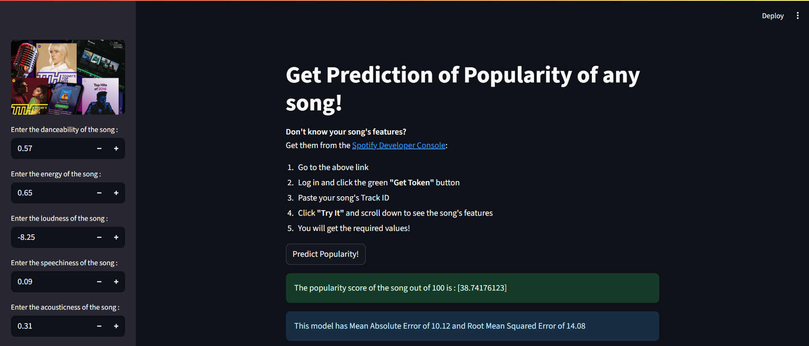
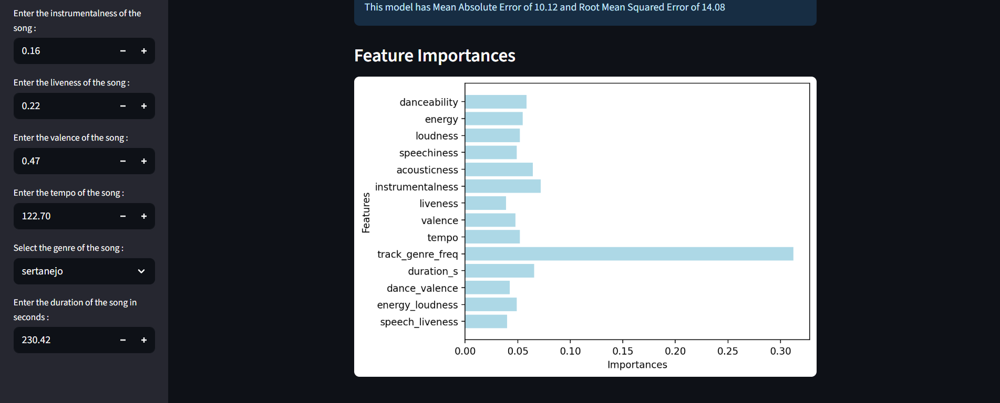

# Get Prediction of Popularity of any song! #
    This is a Machine Learning model that predicts popularity of a song based on various features of the song in the form of a score out of 100 where 100 being the most popular
## Features ##
- Trained on real-life dataset (Access dataset here -> [Spotify tracks dataset] (https://www.kaggle.com/datasets/maharshipandya/-spotify-tracks-dataset))
- Can predict using various features of a song like valence, danceability, loudness, energy, etc

- ### Exploratory Data Analysis ###
    - Data Cleaning and removal of duplicate rows
    - Frequency encoding of high cardinality column 'track_genre'
    - Data Visualization using various plots like heatmaps, barplot, boxplot to identify relationship between 'popularity' column and other columns like explicit, loudness,etc.
    - Creating new columns to promote efficient prediction by the model

- ### Model Training and Evaluation ###
    - Trained using three models -> Linear regression, Logistic Regression and RandomForestRegressor
    - Plotted Feature Importances so as to get columns which contribute more towards better prediction
    - Used "Hyperparameter tuning" to determine best performance model for RandomForestRegressor
    - Model Metrics :
        - R2 Score = 0.46
        - Mean Absolute Error = 10.12
        - Root Mean Squared Error = 14.08
    - Deployed using streamlit
    - Used pickle for model saving
 - ## A glimpse of the webapp ##
 
 
 ## How to get song details? ##
 Get them from the [Spotify Developer Console](https://developer.spotify.com/console/get-audio-features-track/)
    
    1. Go to the above link  
    2. Log in and click the green **"Get Token"** button  
    3. Paste your song's Track ID 
    4. Click **"Try It"** and scroll down to see the song's features  
    5. You will get the required values!

## Author ##
### Poorvaja Joshi ###